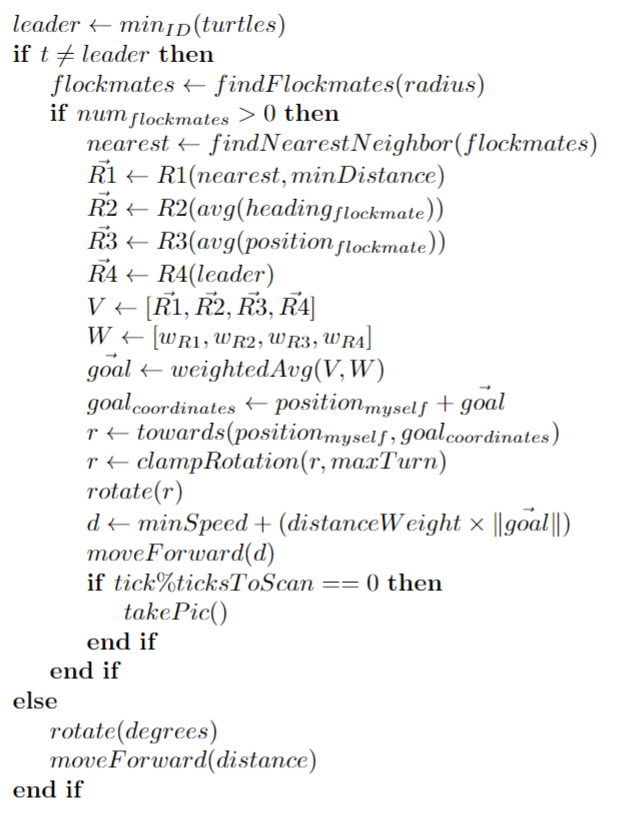
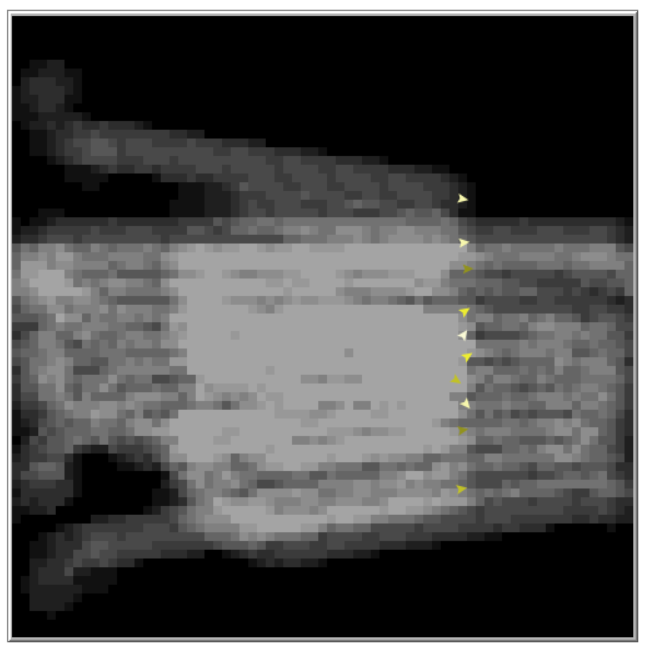

# Vuelo en formación lineal con NetLogo

  <a href="README.md">English</a> |
  Español

Sistema multi-agente implementado en NetLogo que simula un vuelo en bandada siguiendo una formación lineal.

El algoritmo implementado determina en cada tick cuánto debe avanzar un agente y en qué dirección.

Con la calibración adecuada, los agentes siguen una formación en línea alrededor de un agente líder.

# Algoritmo

En cada tick, se elige como líder al agente con menor Id.

Si el agente no es el líder, busca el agente más cercano dentro de un radio y calcula, para cada regla, el vector desplazamiento (relativo al agente) que le harían cumplir esa regla. De este modo se obtienen los vectores R1, R2, R3 y R4. Después se hace una media ponderada de estos vectores (vector objetivo). La dirección del vector objetivo indica la dirección a la que debe avanzar el agente y su magnitud indica con qué intensidad debería hacer el movimiento (o cuán lejos está de satisfacer las reglas). Después se calculan los grados que el agente debe rotar para que su dirección coincida con la del vector objetivo.

Para evitar comportamientos erráticos, antes de aplicar esta rotación, el número de grados se limita a un valor máximo. Una vez el agente apunta a la dirección correcta el agente avanza una distancia que se calcula como una velocidad mínima (en distancia/tick) + longitud del vector objetivo. Por último, si es el momento de tomar una captura del terreno, el agente lo hará.

Si el agente es líder, se moverá de forma independiente con una rotación y velocidad que se pueden controlar desde la interfaz de NetLogo.

Este algoritmo está inspirado en este [artículo](https://www.sciencedirect.com/science/article/abs/pii/S1084804517302606).

## Vectores de cada regla

Los vectores de cada regla se calculan de la siguiente manera:

-   Para calcular R1 se obtiene primero el vector que va del agente más cercano hasta nuestra posición (v). Si la longitud de v es menor que la distancia mínima, entonces R1 tendrá la dirección de v y su magnitud, si no se usan magnitudes normalizadas, será la diferencia entre la distancia mínima y la longitud de v. Si la longitud de v es mayor o igual a la distancia mínima, no se deberá hacer ninguna acción y R1 será (0,0).

-   R2 tiene la dirección hacia la que el agente deberá apuntar para que su rotación sea la misma que la rotación media de sus vecinos. Si no se usan magnitudes normalizadas, la magnitud de R2 será la relación entre el número de grados a rotar y un valor constante.

-   R3 tiene la dirección que va del agente hasta la posición media de los agentes vecinos. Si no se usan vectores normalizados, su magnitud será la distancia del agente hasta esa posición media.

-   R4 tiene la dirección que va del agente hasta la proyección de la posición del agente sobre la línea infinita que cruza al agente líder. Si no se usan vectores normalizados, su magnitud será la distancia del agente hasta esa proyección.

## Interfaz

Desde esta interfaz se pueden modificar los siguientes parámetros principales:

-   Número de agentes en la simulación.

-   Rango de visión de cada agente.

-   Rotación máxima de un agente.

-   Velocidad mínima y máxima de los agentes.

-   Dirección y velocidad del agente líder.

-   Influencia de cada vector regla en el vector objetivo.

-   Normalización de vectores regla.

-   Influencia de la longitud del vector objetivo en la velocidad.

-   Distancia mínima (regla R1).

Desde la interfaz de NetLogo es posible eliminar un agente ualquiera o eliminar el que en ese momento es el agente líder para comprobar que el algoritmo es resistente a fallos y observar cómo la flota de agentes se reorganiza para cubrir el hueco dejado por un agente eliminado o cómo se sigue a un nuevo líder si fuera necesario.

También es posible activar/desactivar y visualizar la monitorización de los agentes sobre el terreno marcándose las celdas del terreno con un color cada vez más claro en función de las veces que ha sido muestreado por algún agente. 

La siguiente figura muestra un terreno siendo escaneado por los agentes.

