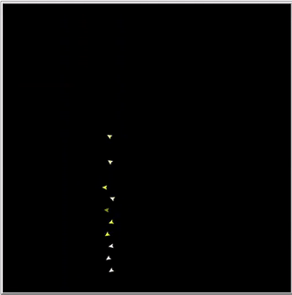
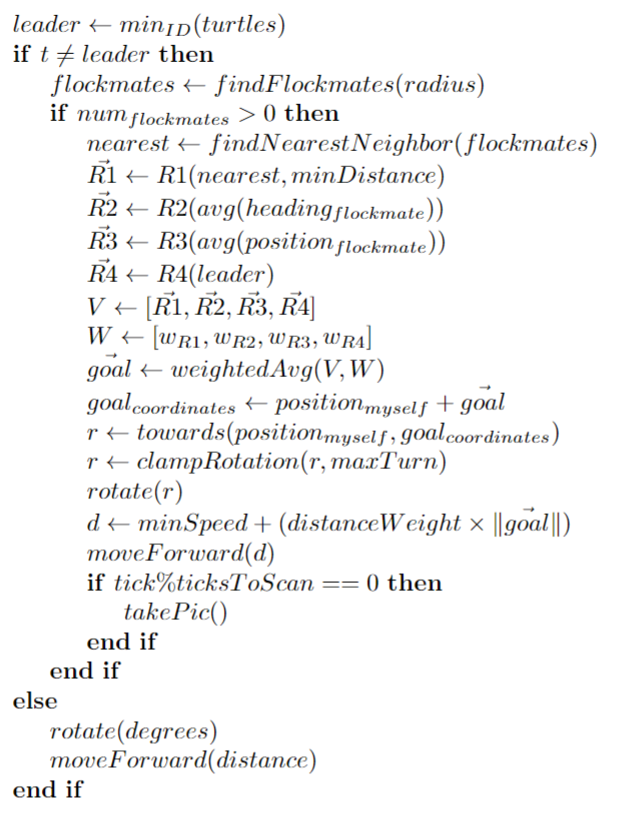
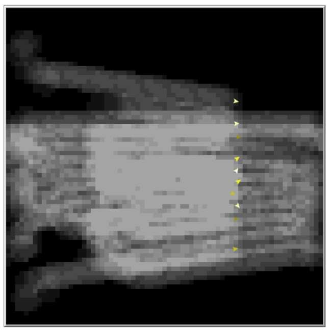

# Linear flocking on NetLogo

  English |
  <a href="README.es-ES.md">Español</a>

Multi-agent system implemented in NetLogo that simulates a flock flight following a linear formation.

The implemented algorithm determines on each tick how far an agent should advance and in which direction.

With proper calibration, the agents follow a linear formation around a lead agent.

# Algorithm

For each tick, the agent with the lowest Id is chosen as the leader.

If the agent is not the leader, it searches for the nearest agent within a radius and calculates, for each rule, the displacement vector (relative to the agent) that would make it comply with that rule. In this way the vectors R1, R2, R3 and R4 are obtained.

Goal vector is obtained as a weighted average of R1, R2, R3 and R4. The direction of goal vector indicates the direction in which the agent should move and its magnitude indicates how strongly it should make the move (or how far it is from satisfying the rules). Then the degrees that the agent should rotate so that its direction matches goal vector are calculated.

To avoid erratic behavior, before applying this rotation, the number of degrees is clamped to a maximum value. Once the agent points to the correct direction the agent advances a distance that is calculated as a minimum velocity (in distance/tick) + length of goal vector. Finally, if it is time to take a capture of the terrain, the agent will do so.

If the agent is leading, it will move independently with a rotation and speed that can be controlled from the NetLogo interface.

This algorithm is inspired by this [paper](https://www.sciencedirect.com/science/article/abs/pii/S1084804517302606).

## Rule vectors

The rule vectors of each rule are calculated as follows:

- To compute R1 we first obtain the vector from the nearest agent to our position (v). If length of v is less than the minimum distance, then R1 will have the direction of v and its magnitude, if normalized magnitudes are not used, will be the difference between the minimum distance and length of v. If length of v is greater than or equal to the minimum distance, no action should be taken and R1 will be (0,0).

- R2 has the direction the agent should point towards so that its rotation is the same as the average rotation of its neighbors. If normalized magnitudes are not used, the magnitude of R2 will be the ratio between the number of degrees to rotate and a constant value.

- R3 has the direction from the agent to the average position of the neighboring agents. If normalized vectors are not used, its magnitude will be the distance from the agent to that mean position.

- R4 has the direction from the agent to the projection of the agent's position on the infinite line crossing the leading agent. If normalized vectors are not used, its magnitude will be the distance from the agent to that projection.

## UI

The following parameters can be modified from the NetLogo UI:

- Number of agents in the simulation.

- Maximum distance that each agent can see.

- Maximum rotation of an agent.

- Minimum and maximum speed of the agents.

- Direction and velocity of the leading agent.

- Influence of each rule vector in the goal vector.

- Normalization of rule vectors.

- Influence of length of goal vector on velocity.

- Minimum distance (rule R1).

From the NetLogo interface it is possible to remove any agent or remove the current lead agent to check that the algorithm is fault resistant and to observe how the agent fleet is reorganized to fill the gap left by a removed agent or how a new leader is choosen if necessary.

It is also possible to enable/disable and visualize the monitoring of the agents on the terrain by marking the terrain cells with a grey level that depends on how many times it has been sampled by an agent. 

The following figure shows a terrain being scanned by the agents.

